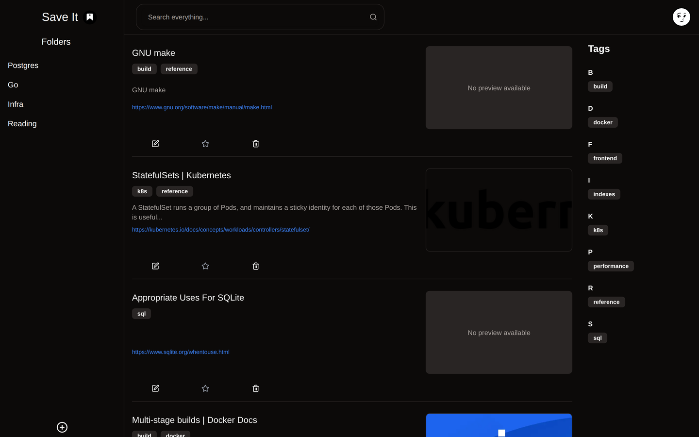
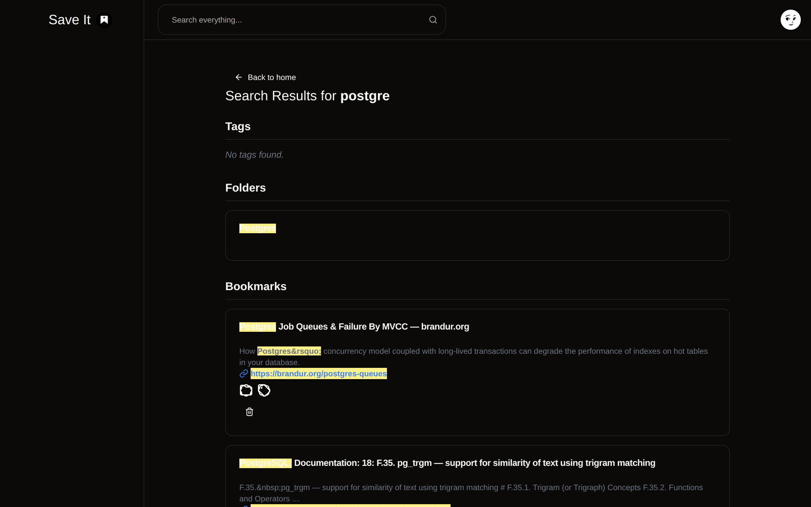

# Save It

A self-hosted bookmark manager. I paste a URL and it fetches the title, description
and preview image itself. Then folders, tags, favourites, archive. Search is Postgres
trigram matching, so it still finds things when I only half-remember the title.

One Next.js app, one Postgres database, `docker compose up -d`. It's been running on
a Raspberry Pi in my homelab since May 2025.

<p align="center">
  
</p>

## Why I built it

My browser bookmarks had turned into a place links went to be forgotten. A flat list
of a few hundred entries, most of them titled whatever the page happened to call
itself. Finding anything meant scrolling and hoping, so I stopped looking and just
re-googled things I'd already saved.

I wanted two things. A saved link that describes itself without me typing anything,
and search that still works when my memory of the title is approximate. The rest of
the app exists to support those two.

## What it does

**Save.** Paste a URL and hit the wand, and it fetches the page and pulls out the
title, description and preview image. The fetch streams and stops at `</head>`, caps
at 5MB, times out at 8s, and caches 500 URLs for an hour. If it fails the bookmark
still saves and I fill it in myself.

**Organise.** One folder per bookmark, any number of tags. Tags can be created inline
while saving. Favourite and archive are separate flags.

**Find.** Five match modes — exact, contains, starts-with, fuzzy and loose. Fuzzy and
loose are `word_similarity()` from `pg_trgm`, above a threshold of 0.7 and 0.5; the
other three are `ILIKE`. Any of them can target the title, description, URL, tag,
folder, or everything at once, and results come back rank-ordered with the matched
runs highlighted. A separate filters page narrows by folder, tag and the two flags.

<p align="center">
  
</p>

The search box opens on exact; fuzzy is a click away on the mode row. Worth knowing
because fuzzy is scored against the whole query string rather than word by word, so
one word finds things a two-word phrase won't: `word_similarity('postgre', title)`
scores 0.875 against my pg_trgm bookmark and clears the threshold, but
`word_similarity('postgre trigram', title)` scores 0.500 against the same row and
doesn't. Short queries are the ones fuzzy is good at.

**Adjust.** Theme, bookmarks per page, which fields show on a card, card layout. The
account tab handles password changes and account deletion.

Accounts are email and password. There's no mail server wired up, so no email
verification and no password reset by email.

## Running it locally

Node 20.9+, pnpm and Docker. pnpm is pinned in `package.json`, so `corepack enable`
picks the right version.

```sh
git clone https://github.com/pratiknkulkarni/saveit.git
cd saveit
cp .env.example .env
```

`BETTER_AUTH_SECRET` is the only blank in the file. Fill it with `openssl rand -hex 32`.
Everything else already lines up with `docker-compose.dev.yml`.

```sh
docker compose -f docker-compose.dev.yml up -d
docker compose -f docker-compose.dev.yml exec postgres \
    psql -U saveit -d saveit -c 'CREATE DATABASE saveit_test;'

pnpm install
pnpm prisma generate
pnpm prisma migrate deploy
pnpm dev
```

http://localhost:33449. Only the database runs in Docker; the dev server runs on the
host.

`saveit_test` has to exist because the test setup truncates every table before each
test. Point `TEST_DATABASE_URL` at the same database as `DATABASE_URL` and running the
suite wipes whatever you were working on.

## Deploying it

`docker-compose.yml` pulls a prebuilt image rather than building one, so that file plus
a filled-in `.env` is the whole deploy. The host never needs a copy of the source.

Three values matter:

- `NEXT_PUBLIC_API_URL` — the URL you actually type into the browser. It's injected at
  runtime and becomes the address the browser calls for auth, so on a Pi it has to be
  the Pi's address rather than `localhost`. Get it wrong and login fails without
  saying why.
- `BETTER_AUTH_TRUSTED_URLS` — the same URL, comma-separated if there's more than one.
  Set it, but don't lean on it; see "What isn't done".
- `BETTER_AUTH_SECRET` and `POSTGRES_PASSWORD` — `openssl rand -hex 32` each. Changing
  the secret signs everyone out.

`DATABASE_URL` from `.env` is ignored here. Compose builds its own from the `POSTGRES_*`
values, pointing at the `postgres` service; the one in `.env` is localhost-based and
only there for the Prisma CLI.

Images are `linux/arm64`, because the only CI runner is a Raspberry Pi 4:

```sh
docker login gitea.15092021.xyz
docker compose pull && docker compose up -d
```

`pull` on its own doesn't touch anything already running. On a machine that isn't arm64
the pull fails outright, so build it locally under the same tag instead:

```sh
docker build -t gitea.15092021.xyz/pratik/saveit:latest .
docker compose up -d
```

The container applies migrations before it starts serving, so a fresh volume sets itself
up and a restart with nothing pending is a no-op. Migrations are forward-only, so take a
`pg_dump` before a destructive one. Every build is also tagged with its commit, which
makes `IMAGE_TAG=main-1e07bc0 docker compose up -d` a code-only rollback.

## Stack

| Layer | Choice |
|---|---|
| Framework | Next.js 15.1 App Router, React 19 |
| Language | TypeScript 5.9, `strict` |
| Backend | Next.js Server Actions. No REST layer, no tRPC |
| Database | PostgreSQL 16 with `pg_trgm` |
| ORM | Prisma 6.14 |
| Auth | better-auth, email and password only |
| Data fetching | TanStack Query v5 |
| Styling | Tailwind with shadcn/ui on Radix |
| Validation | zod |
| Logging | pino |
| Tests | Vitest |
| Package manager | pnpm 9.15.9, pinned |

Everything server-side is a server action in `app/actions/`. The only API route in the
whole app is the better-auth catch-all. Actions read the session themselves instead of
taking a user ID from the client, so nobody gets someone else's bookmarks by changing
an argument.

Search is the one place with hand-written SQL, because `word_similarity()`, `STRING_AGG`
and the CTEs involved aren't things Prisma will express. Every user-supplied value in it
is a bound parameter. 117 tests cover it and the rest of the data layer against a real
Postgres rather than a mock.

## What isn't done

**The SSRF check is weaker than it looks.** `isUnsafeUrl` in
`app/actions/metadatafetcher.ts` blocks `localhost` and hostnames that literally start
with `127.`, `10.`, `192.168.` or `169.254.`. That is a string comparison on the
hostname, not an address check, so it misses `172.16.0.0/12` — which is where Docker
puts its bridges — along with IPv6, the decimal and hex spellings of an IPv4 address,
and any DNS name that happens to resolve into private space. Redirects are followed
three deep and not re-checked, so a public URL that 302s inward is fetched. Doing this
properly means resolving the hostname and validating the resolved IP, on the original
request and on every hop. Until then, this is a single-user app on a private network
and I treat it as one. Don't expose it to strangers.

**`BETTER_AUTH_TRUSTED_URLS` doesn't do anything yet.** `lib/auth.ts` passes
`trustedOrigins` but never sets `baseURL`, so better-auth derives the base URL from
each incoming request and trusts that request's own origin. A sign-in sent with
`Origin: http://evil.example.com` comes back 200. Passing an explicit `baseURL` to
`betterAuth()` is what makes the variable mean anything. Related: `next.config.ts`
sends `Access-Control-Allow-Origin: *` alongside `Access-Control-Allow-Credentials:
true` on `/api/*`, which browsers refuse to honour together — the pair should not be
there either way.

**A hydration mismatch on `/home`.** `components/Header.tsx` renders the avatar only
once the client-side session exists, so the server sends the fallback and React
throws the tree away on hydration. It costs a re-render and shows up as an error
overlay in dev.

**No backup job.** Migrations are forward-only and nothing takes a `pg_dump` on a
schedule.

## How this was built

It started on SQLite with MiniSearch doing the search. Both are gone now. Moving to
Postgres was about `pg_trgm`: it does fuzzy matching properly and let me delete the
search index I'd been maintaining by hand.

I wrote the app and had it running on the Pi from May 2025, on SQLite at first. The
Postgres move and the search rewrite were February 2026. In August 2026 I used
[Claude Code](https://claude.com/claude-code) for the part I'd been putting off: a
proper standalone image, CI that builds and publishes to my own registry, test coverage
over things I'd only ever checked by hand, and the account settings tab.

---

Developed on a self-hosted [Gitea](https://gitea.15092021.xyz/pratik/saveit) that runs in
my homelab; the copy on GitHub is a read-only mirror of it, pushed on every commit.
Issues and pull requests are welcome on the GitHub side and I will port them across.
